> 测试对象：淄博某某大学。

## 从入口开始：先确认身份边界

这次测试从后台登录入口开始。我先核查身份认证和权限分层，发现其中存在风险。涉及的网址、账号、口令以及登录细节：`xxx`。

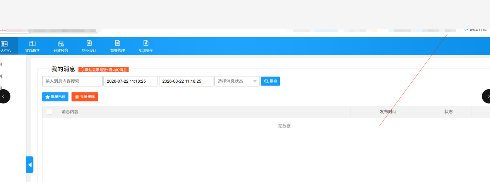

登录后，我先确认当前身份实际能够访问哪些功能，再检查页面显示与权限控制是否一致。具体角色、验证过程与系统标识：`xxx`。

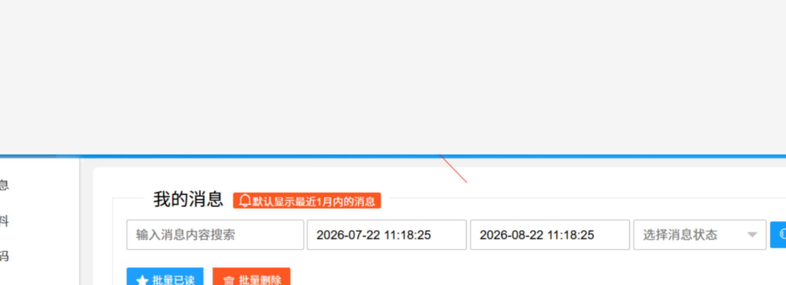

## 后台访问：检查认证与授权是否一致

后台认证存在弱口令问题，测试中通过弱口令成功登录后台。账号口令、登录地址和验证信息：`xxx`。

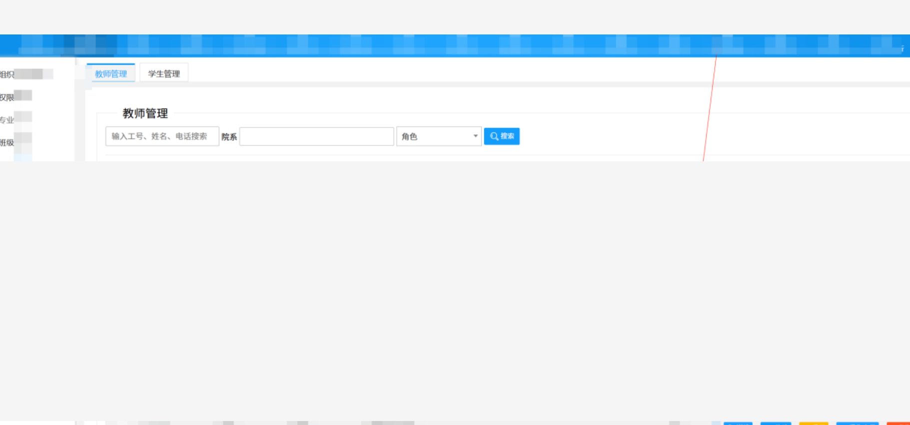

随后我继续检查管理功能，发现权限边界也存在问题。相关操作步骤、页面路径、请求参数及权限细节：`xxx`。接下来重点核对服务端是否对每个请求独立校验身份与权限。

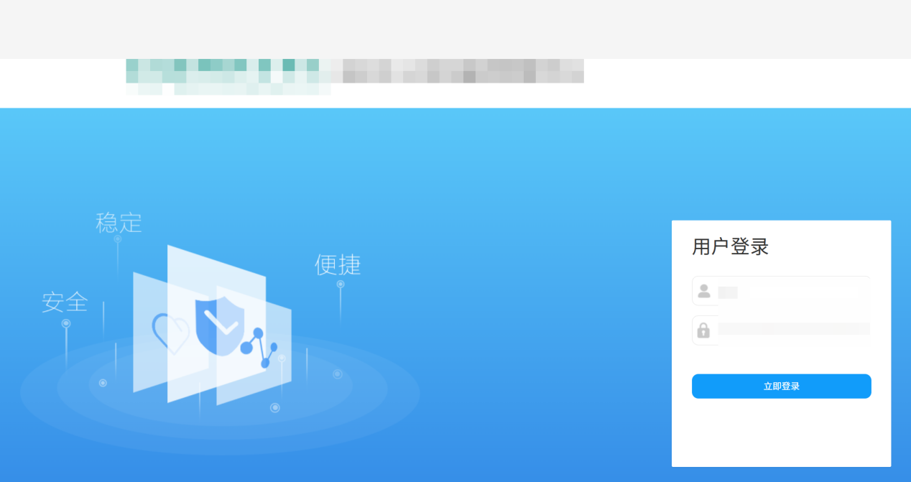

## 权限边界：页面可见不等于有权访问

检查过程中，我对照后台页面与接口的权限校验。即使前端隐藏了某个入口，服务端仍应确认当前身份是否有权访问相应功能和数据对象。涉及的接口、请求内容、对象标识和响应数据：`xxx`。

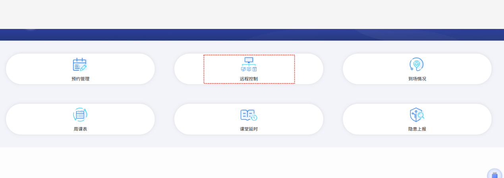

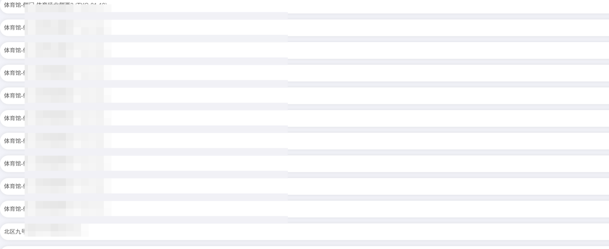

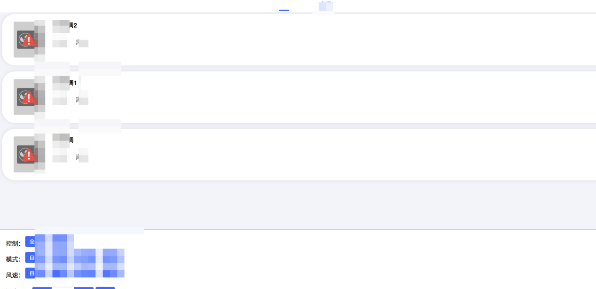

## 校园业务：把影响控制在授权范围内

这次测试还涉及门禁、人员认证和设备管理等校园业务。我对相关功能的访问边界进行核查，业务字段、数据内容、影响范围和数量：`xxx`。

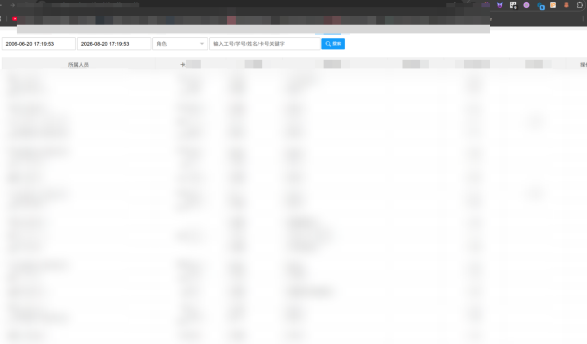

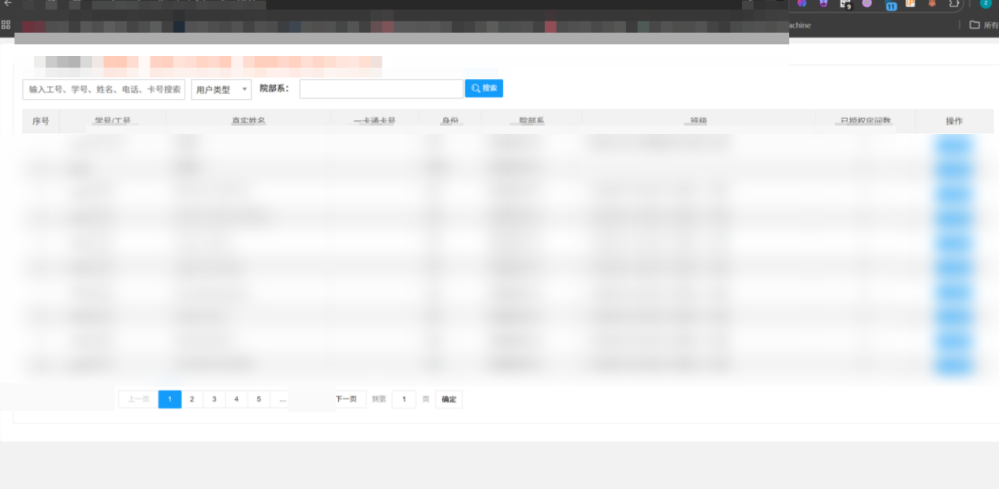

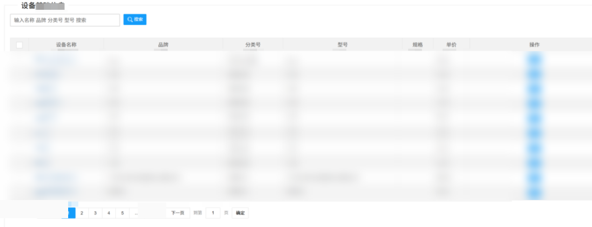

## 后勤服务：令牌与数据都要有边界

之后我检查了后勤服务模块，将会话令牌和业务数据访问范围纳入核查。有效期、令牌内容、服务地址、脚本路径、工单记录和请求响应：`xxx`。

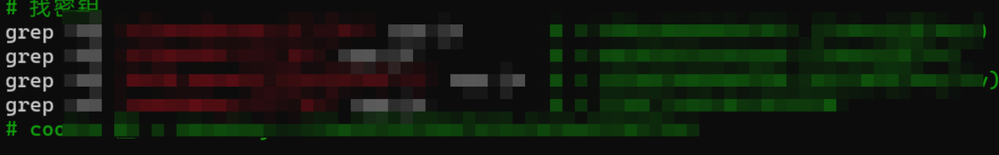

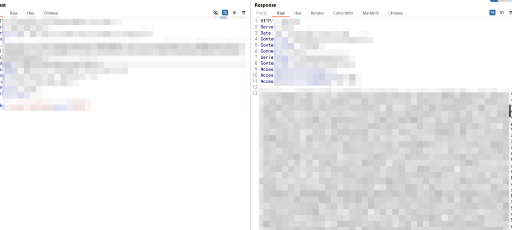

检查中还涉及工单与账号类数据，相关记录、凭证、字段和数据规模：`xxx`。

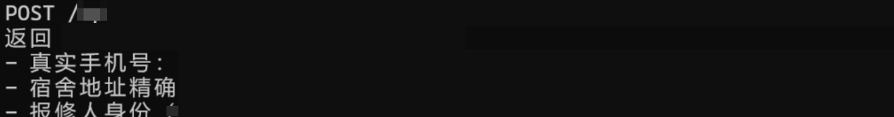

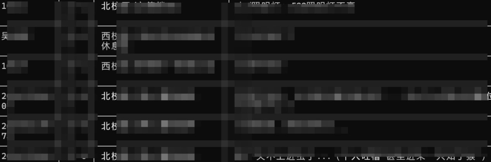

## 复盘与整改

这次测试让我意识到，后台安全并不取决于菜单有多少层，而取决于每次请求是否都经过可靠的身份认证、角色检查和对象级授权。发现风险后，应以最小影响方式留存必要证据，并及时向系统负责人报告。

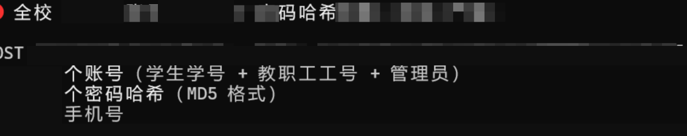

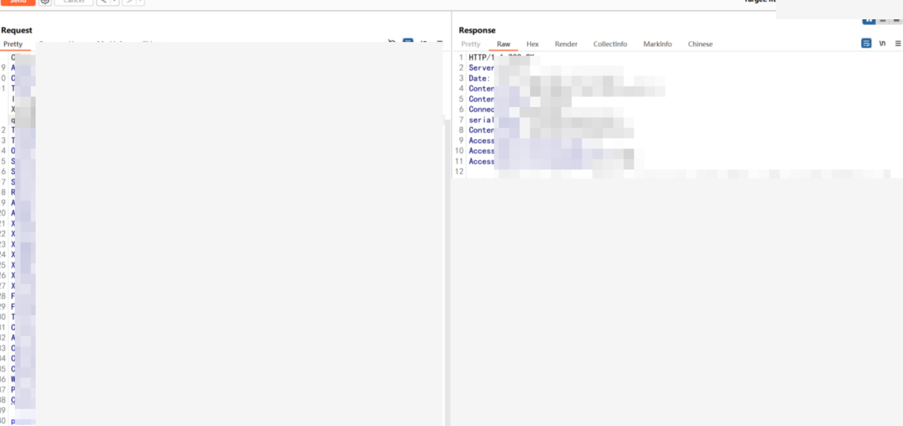

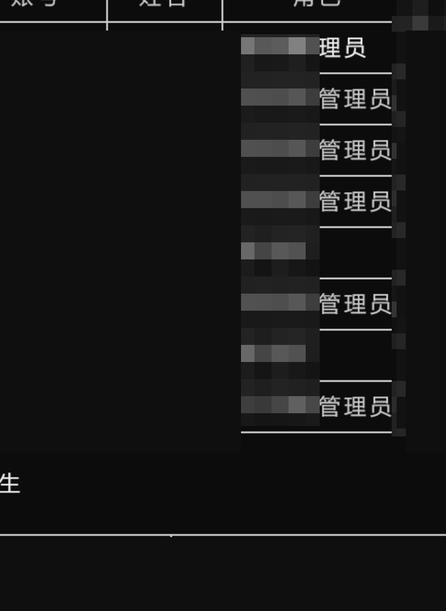

- 对高权限账号采用强认证，清理默认或弱口令，并轮换可能暴露的凭证。
- 在服务端逐请求落实角色与对象级授权，避免只依赖前端菜单控制访问。
- 为会话令牌设置最小权限、合理有效期和撤销机制，监测异常复用。
- 对敏感查询、导出和管理操作保留审计记录，并定期检查授权范围。
- 使用低权限测试账号进行回归，确认其只能访问职责范围内的功能与数据。

真正有价值的复盘，既要把问题讲清楚，也要把系统和使用者保护好。验证边界、减少数据接触、推动修复，再用回归确认风险已经收敛，才算为一次测试画上完整的句号。

✦ 把热爱放进每一次练习，脚下的路就会通向更高的山。
