> 本文按原始记录整理。目标站点、账号口令、接口参数和个人标识统一以 xxx 代替；截图中的敏感区域已遮挡。文章聚焦风险影响与修复复盘，不展示可直接复现的调用细节。

## 案例一：安徽某某大学教学管理系统

目标学校：安徽某某大学；站点地址：xxx。

### 管理员权限与数据暴露

记录显示，系统存在未授权获取职工标识的入口，具体页面与参数：xxx。管理员账号同时存在弱口令风险，账号及口令：xxx；相关教师账号信息：xxx。

在取得管理员权限后，可以访问大量学生记录。涉及的数据规模、证件字段及页面参数：xxx。

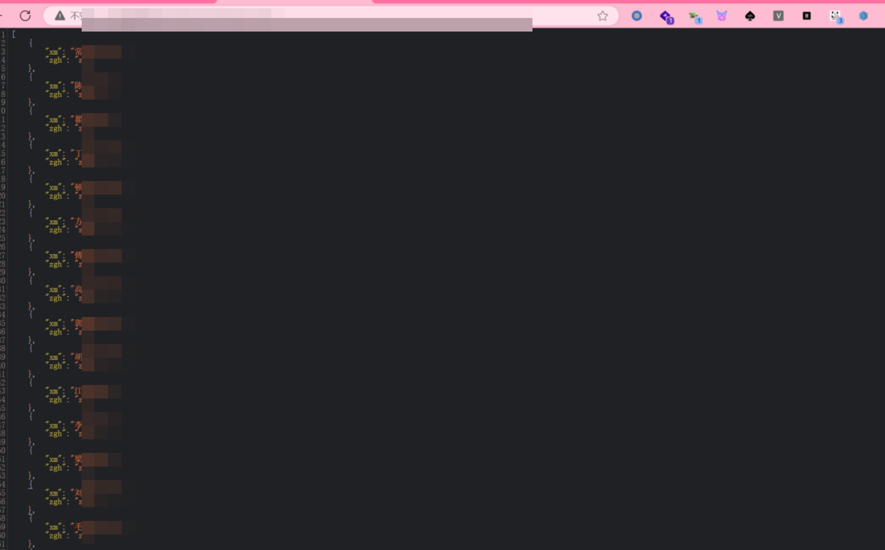

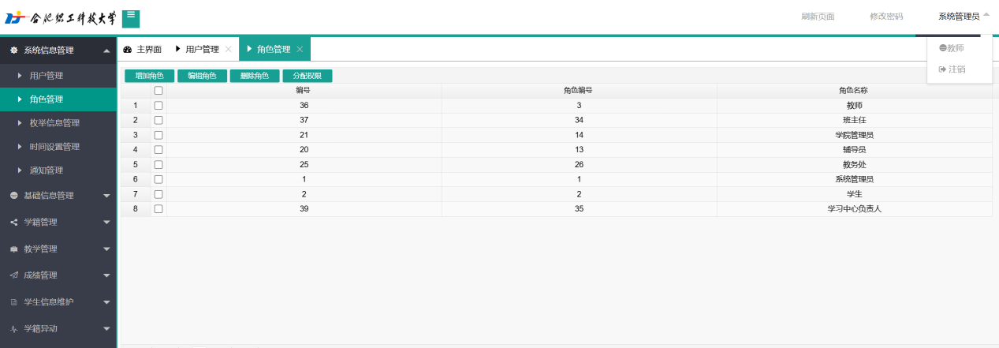

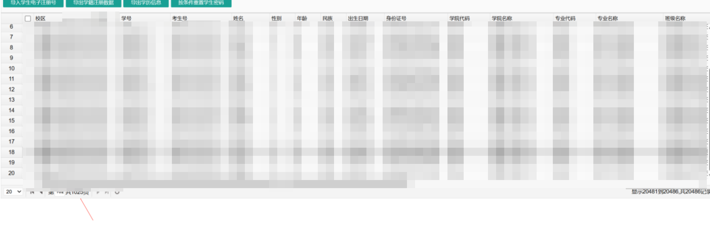

### 普通账号越权

使用普通教师账号检查时，发现多个功能缺少服务端权限校验。账号信息、接口地址与参数：xxx。

用户列表功能可触达超出当前账号权限范围的数据；涉及的记录数量和字段：xxx。

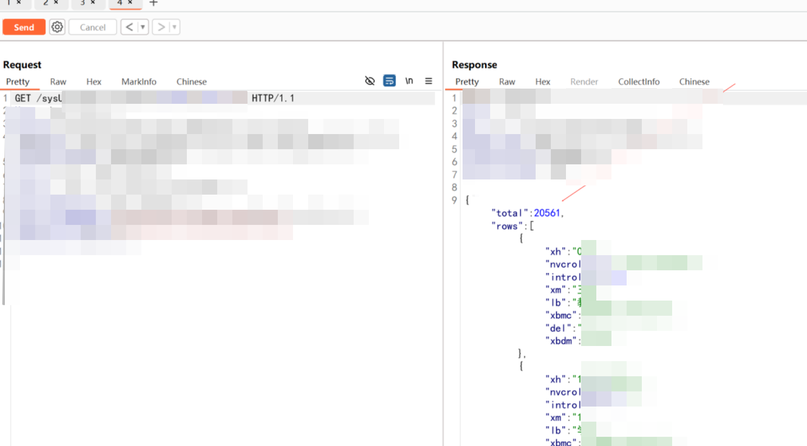

学生信息查询功能存在相同问题。接口、参数、学生标识及可见字段：xxx。

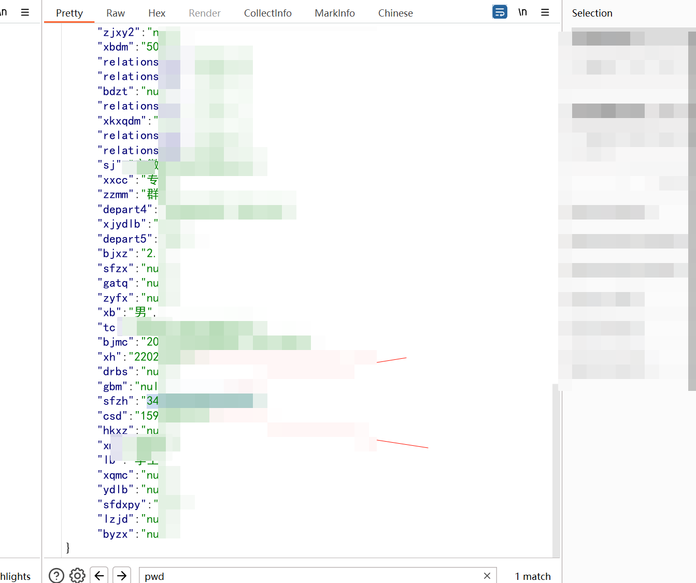

用户列表与学生详情查询还可能组合扩大影响。学籍导出功能涉及的地址、参数、数量和证件字段：xxx。

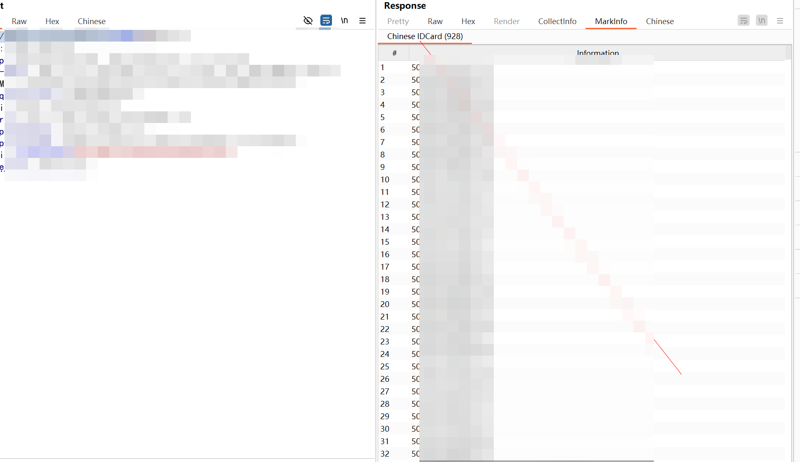

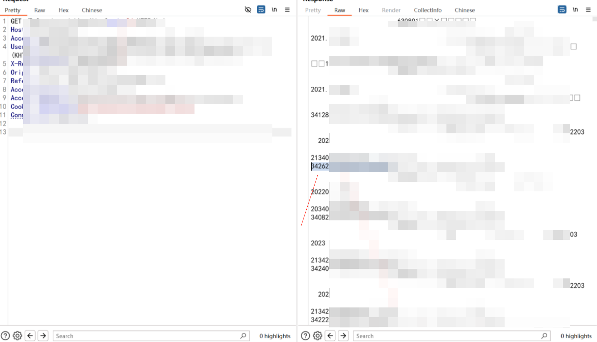

毕业生信息查询也存在越权访问风险；具体地址、参数、数量和个人字段：xxx。

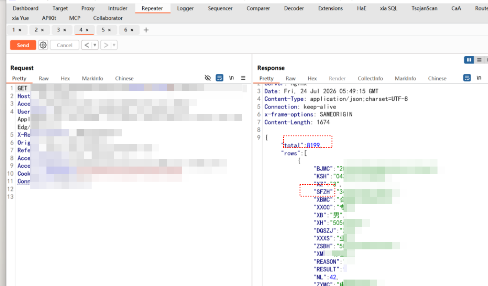

## 案例二：安徽某某学院学生与教师信息越权访问

目标学校：安徽某某学院；站点地址和账号信息：xxx。

### 未授权查询

学生信息查询未充分校验访问权限，涉及多个年级。查询标识、规律和数据范围：xxx。

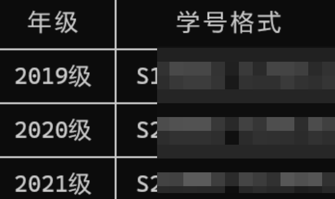

记录涉及证件、联系方式与账号相关字段，具体内容：xxx。

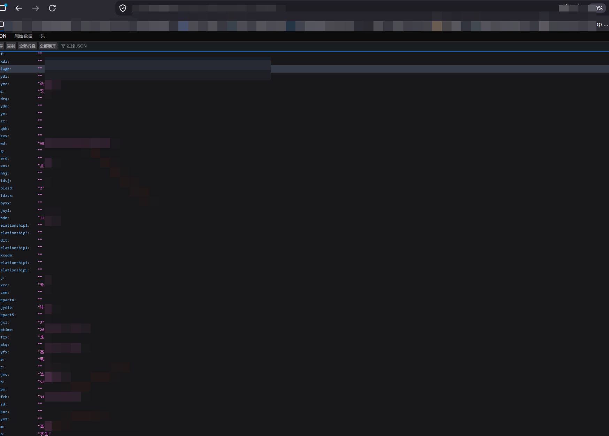

班级信息查询可以触达未授权的班级资料及工作人员信息；接口、参数和字段：xxx。

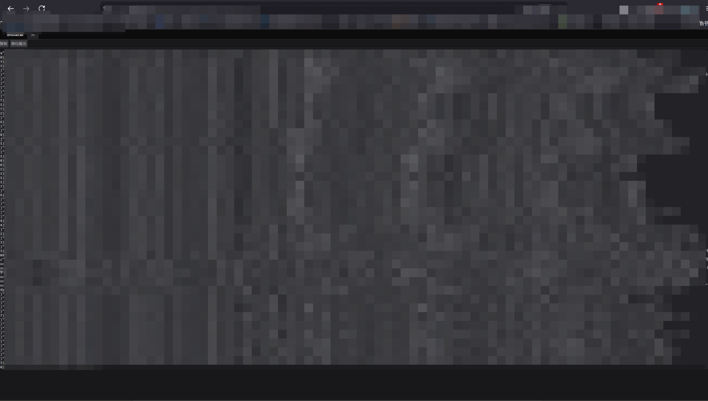

教师资料查询可以通过职工标识读取个人信息；接口、标识和信息字段：xxx。

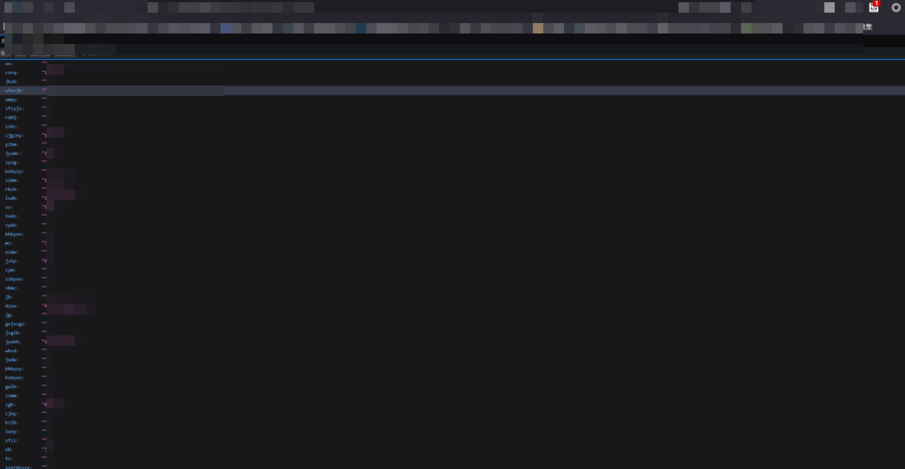

### 高权限功能越权

普通教师账号信息：xxx。记录显示，普通账号可以访问高权限账号管理功能，影响涉及账号资料、重置与删除操作；接口、参数和操作细节：xxx。

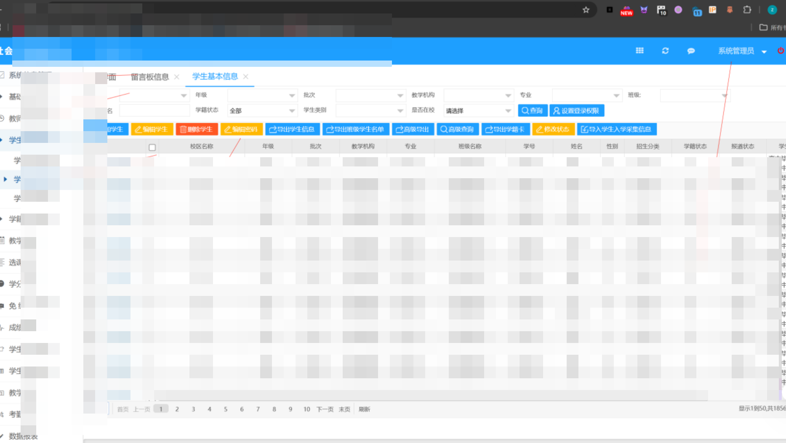

普通账号还可访问完整的教师管理页面；页面地址：xxx。

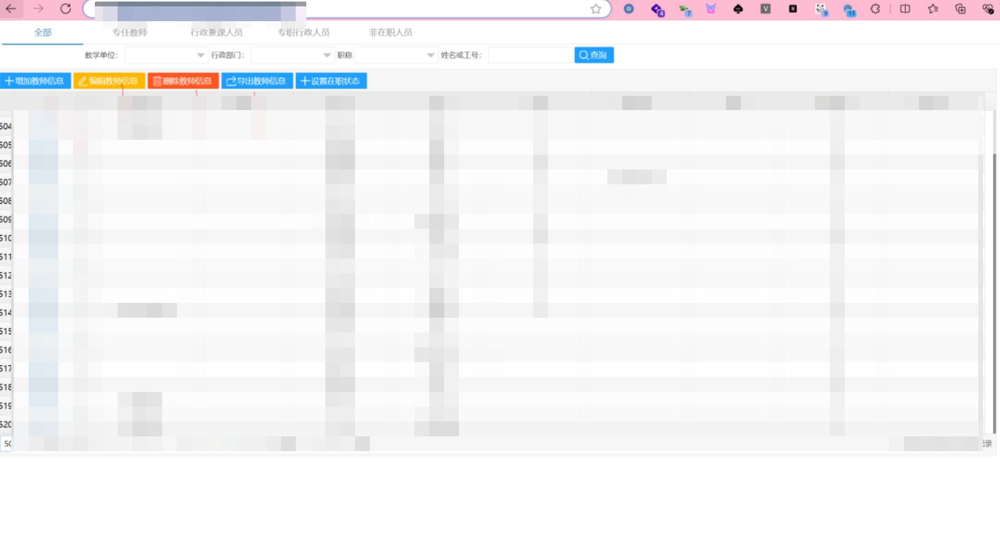

学生删除操作同样缺少充分的对象权限校验。具体接口、学生标识与请求参数：xxx。

## 修复情况与复盘

上述问题已修复。两起案例都指向同一类根因：系统确认了用户身份，却没有在每次请求中进一步校验角色权限和数据对象归属。登录成功不应自动获得其他学院、年级或用户的数据访问权，更不应允许普通账号触达管理、重置或删除功能。

回归检查应覆盖用户列表、学生与教师资料、查询与导出、账号管理及删除操作。验证重点是普通账号只能访问授权范围内的数据，不能通过更换标识、调整参数或组合功能绕过权限；敏感操作还应保留可追溯的审计记录，并及时清理弱口令。

这次复盘也提醒我：一次请求能返回数据，不代表访问就合理。真正可靠的修复，需要把权限校验放在服务端、落到每个对象和每个操作上，再用普通账号逐项验证边界。

✦ 愿每一次认真复盘，都成为下一次更稳地守护边界的力量。
